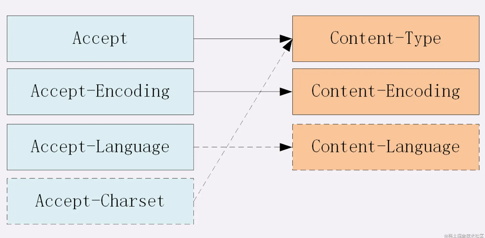

##### 12、常见的http请求头：
常见的请求头字段：
- Host: 服务端的域名
- Accept、Accept-Encoding、Accept-Language：与服务端的协商字段
- Content-Type：浏览器请求体内容的类型
- Content-Length：实体数据的字节长度。
- Referer：请求的页面来源。
- User-Agent：用户代理，一些厂商、设备、版本等信息。
- Cookie：用户的Cookie信息。
- 还有上面提到的缓存相关字段

常见的响应头字段：
- Access-Control-Allow-Origin：指定哪些网站可以跨域源资源共享。
- Access-Control-Allow-Methods：允许的http请求方法
- Content-Type：服务端响应体内容的类型。
- Content-Length：实体数据的字节长度，如果设置短了数据会丢失，设置长了会导致请求失败。
- Set-Cookie：与请求头中的 Cookie 对应
- 还有上面提到的缓存相关字段

**请求头里的Referer是干什么用的？**
设置一些防盗链，比如直接在浏览器的地址栏中输入一个资源的URL地址，那么这种请求是不会包含Referer的。

**Content-Length是什么的长度？**
实体的传输字节长度。（实体长度和实体的传输长度是有区别，比如说gzip压缩下，消息实体长度是压缩前的长度，消息实体的传输长度是gzip压缩后的长度）,`设置的比实际传输的小会截取多余的部分，比实际大会出错`，`Content-Length 用于定长传输`

**知道Transfer-Encoding: chunked这个字段吗？**
在数据内容不能确定，分块传输场景下使用。（无法在请求或者响应前明确指定Content-Length，所以Content-Length字段会被忽略不被发送）,`用于不定长传输`,表示分块传输数据，设置这个字段后会自动产生两个效果:
- Content-Length 字段会被忽略
- 基于长连接持续推送动态内容
> 注意：最后是留有有一个空行的

**Cookie中有哪些属性？**
- Name：Cookie的名称。
- Value： Cookie的值。
- Domain： 指定Cookie的域名。
- Path：指定Cookie所属的路径。（只有匹配上Domain和Path才会附加Cookie）
- Expires/Max-Age: 过期时间
- Size：Cookie的大小
- HttpOnly：禁止通过document.cookie等方式拿到Cookie。（缓解XSS攻击）
- Secure： Cookie只能用https协议发送给服务器。
- SameSite：可以有效缓解CSRF攻击。
- SameSite=None: 浏览器会在同站请求、跨站请求下继续发送Cookie。
- SameSite=Strict: 限制Cookie不能跨站发送，只在访问相同站点时发送Cookie。
- SameSite=Lax: 跨站请求时，如果是安全的HTTP方法情况会携带Cookie。

**同源和同站的区别是什么？**
同源：scheme://ip/hostname:port一样表示同源
同站：二级域名.顶级域名一样表示同站。
[掘金好文](https://juejin.cn/post/6877496781505200142)


### 了解HTTP的header的意义吗？前端有必要学习这些东西吗？


### 对 Accept 系列字段了解多少？
对于Accept系列字段的介绍分为四个部分: `数据格式`、`压缩方式`、`支持语言`和`字符集`。
- 数据格式
上一节谈到 HTTP 灵活的特性，它支持非常多的数据格式，那么这么多格式的数据一起到达客户端，客户端怎么知道它的格式呢？
当然，最低效的方式是直接猜，有没有更好的方式呢？直接指定可以吗？
答案是肯定的。这些类型体现在Content-Type这个字段，当然这是针对于发送端而言，接收端想要收到特定类型的数据，也可以用Accept字段。
具体而言，这两个字段的取值可以分为下面几类:

text： text/html, text/plain, text/css 等
image: image/gif, image/jpeg, image/png 等
audio/video: audio/mpeg, video/mp4 等
application: application/json, application/javascript, application/pdf, application/octet-stream

- 压缩方式
当然一般这些数据都是会进行编码压缩的，采取什么样的压缩方式就体现在了发送方的`Content-Encoding`字段上， 同样的，接收什么样的压缩方式体现在了接受方的`Accept-Encoding`字段上。这个字段的取值有下面几种：

gzip: 当今最流行的压缩格式
deflate: 另外一种著名的压缩格式
br: 一种专门为 HTTP 发明的压缩算法
```js
// 发送端
Content-Encoding: gzip
// 接收端
Accept-Encoding: gzip
```

- 支持语言
对于发送方而言，还有一个Content-Language字段，在需要实现国际化的方案当中，可以用来指定支持的语言，在接受方对应的字段为Accept-Language。如:
```js
// 发送端
Content-Language: zh-CN, zh, en
// 接收端
Accept-Language: zh-CN, zh, en
```

- 代码字符集
最后是一个比较特殊的字段, 在接收端对应为`Accept-Charset`，指定可以接受的字符集，而在发送端并没有对应的Content-Charset, 而是直接放在了Content-Type中，以charset属性指定。如:
```js
// 发送端
Content-Type: text/html; charset=utf-8
// 接收端
Accept-Charset: charset=utf-8
```

见图：



##### 一个请求由哪些部分构成？
请求报文和响应报文大致上都是 起始行+头部+空行+实体。

- 起始行
  请求报文起始行： 请求方法 路径 HTTP版本。
  响应报文起始行： HTTP版本 状态码 状态。

- 头部
  就是常见的那些请求头响应头字段。

- 空行
  区分头部和实体。

- 实体
  请求携带的数据或者响应返回的数据。

Q: 头部中间加一个空行会怎么样？
空行后面的内容都是实体了。
