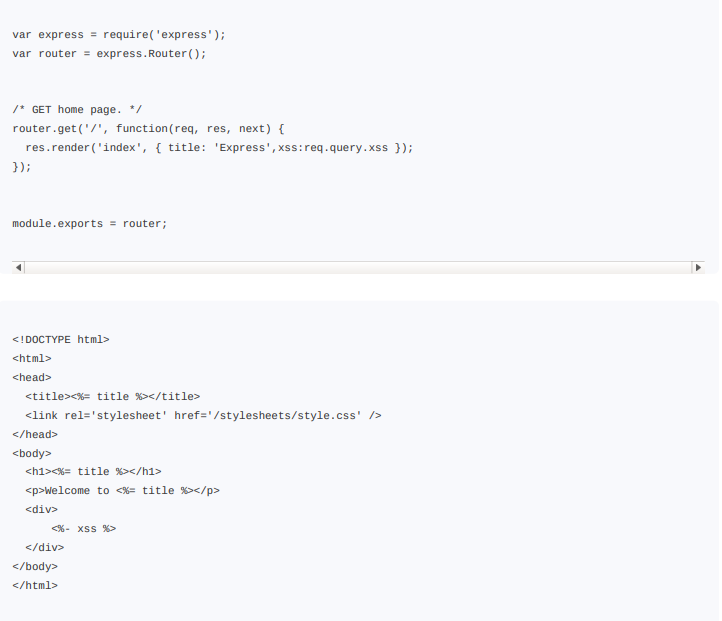
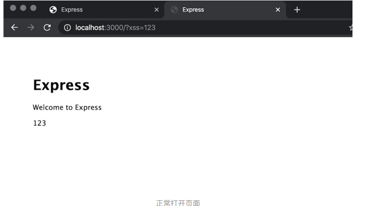
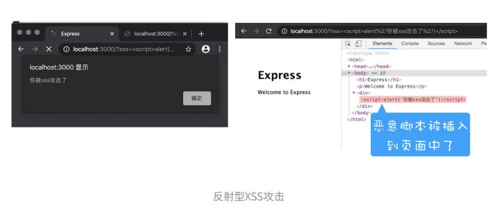

##### xss 攻击以及防范措施？
**是什么：**
XSS攻击是指⿊客往HTML⽂件中或者DOM中注⼊恶意脚本，从⽽在⽤⼾浏览⻚⾯时利⽤注⼊的恶意脚本对⽤⼾实施攻击的⼀种⼿段。

**举例说明：**
- 窃听 Cookie 信息：恶意 JS 可以通过 document.cookie 获取 cookie 信息，然后通过 XMLHttpRequest 或者 Fetch 加上 CORS 功能将数据发送给恶意服务器，然后恶意服务器拿到用户cookie信息，模拟用户操作，进行转账等操作。
- 监听用户行为：恶意 js 可以使用 addEventListener 接口来监听键盘事件，比如获取用户输入信用卡等信息，然后发送到黑客的服务器。
- 可以修改 DOM 伪造假的登陆窗口，用来欺骗用户输入用户名和密码等信息。
- 可以在页面浮窗广告，严重影响用户体验。

注入方式：
- 存储型 XSS 攻击
- 反射型 XSS 攻击
- DOM 型 XSS 攻击

**存储型 XSS 攻击：**
- ⾸先⿊客利⽤站点漏洞将⼀段恶意JavaScript代码提交到⽹站的数据库中；
- 然后⽤⼾向⽹站请求包含了恶意JavaScript脚本的⻚⾯；
- 当⽤⼾浏览该⻚⾯的时候，恶意脚本就会将⽤⼾的Cookie信息等数据上传到服务器

**反射型 XSS 攻击：**
定义： 
在⼀个反射型XSS攻击过程中，恶意JavaScript脚本属于⽤⼾发送给⽹站请求中的⼀部分，随后⽹站⼜把恶意JavaScript脚本返回给⽤⼾。当恶意JavaScript脚本在⽤⼾⻚⾯中被执⾏时，⿊客就可以利⽤该脚本做⼀些恶意操作。

上面定义比较抽象，看看图片就明白了：

上⾯这两段代码，第⼀段是路由，第⼆段是视图，作⽤是将URL中xss参数的内容显⽰在⻚⾯。我们可以在本地演⽰下，⽐如打开http://localhost:3000/?xss=123这个链接，这样在⻚⾯中展⽰就是“123”了（如下图），是正常的，没有问题的。

但当打开http://localhost:3000/?xss=这段URL时，其结果如下图所⽰：

通过这个操作，我们会发现⽤⼾将⼀段含有恶意代码的请求提交给Web服务器，Web服务器接收到请求时，⼜将恶意代码反射给了浏览器端，这就是反射型XSS攻击。在现实⽣活中，⿊客经常会通过QQ群或者邮件等渠道诱导⽤⼾去点击这些恶意链接，所以对于⼀些链接我们⼀定要慎之⼜慎。

> 注意： Web服务器不会存储反射型XSS攻击的恶意脚本，这是和存储型XSS攻击不同的地⽅。

**DOM 型 XSS 攻击：**
基于DOM的XSS攻击是不牵涉到⻚⾯Web服务器的。具体来讲，⿊客通过各种⼿段将恶意脚本注⼊⽤⼾的⻚⾯中，⽐如通过⽹络劫持在⻚⾯传输过程中修改HTML⻚⾯的内容，这种劫持类型很多，有通过WiFi路由器劫持的，有通过本地恶意软件来劫持的，它们的共同点是在Web资源传输过程或者在⽤⼾使⽤⻚⾯的过程中修改Web⻚⾯的数据。

###### 阻止 XSS 的方法：
- 服务器对输⼊脚本进⾏过滤或转码
- 充分利⽤CSP
  - 限制加载其他域下的资源⽂件，这样即使⿊客插⼊了⼀个JavaScript⽂件，这个JavaScript⽂件也是⽆法被加载的
  - 禁⽌向第三⽅域提交数据，这样⽤⼾数据也不会外泄；
  - 禁⽌执⾏内联脚本和未授权的脚本；
  - 还提供了上报机制，这样可以帮助我们尽快发现有哪些XSS攻击，以便尽快修复问题。
- 使⽤HttpOnly属性（由于很多XSS攻击都是来盗⽤Cookie的，因此还可以通过使⽤HttpOnly属性来保护我们Cookie的安全，这样 cookie 就不会被 js 读取）

##### csrf以及防范措施？
- 受害者登录a.com，并保留了登录凭证（Cookie）。
- 攻击者引诱受害者访问了b.com。
- b.com 向 a.com 发送了一个请求：a.com/act=xx。浏览器会默认携带a.com的Cookie。
- a.com接收到请求后，对请求进行验证，并确认是受害者的凭证，误以为是受害者自己发送的请求。
- a.com以受害者的名义执行了act=xx。
- 攻击完成，攻击者在受害者不知情的情况下，冒充受害者，让a.com执行了自己定义的操作。

说白了就是：CSRF攻击就是⿊客利⽤了⽤⼾的登录状态，并通过第三⽅的站点来做⼀些坏事。

预防措施：
1、关键操作使用验证码。
2、通过Referer来检查请求的"源"。（在服务器端验证请求来源的站点）
  - Referer是HTTP请求头中的⼀个字段，记录了该HTTP请求的来源地址。
  - 但在服务器端验证请求头中的Referer并不是太可靠，因此标准委员会⼜制定了Origin属性，（Origin属性只包含了域名信息，并没有包含具体的URL路径，这是Origin和Referer的⼀个主要区别。在这⾥需要补充⼀点，Origin的值之所以不包含详细路径信息，是有些站点因为安全考虑，不想把源站点的详细路径暴露给服务器。）
3、服务端Token校验机制。
4、之前说到Cookie设置的SameSite。

##### XSS 和 CSRF 区别：
- XSS 需要往页面里面注入恶意脚本
- CSRF 不会往页面里面注入脚本，其最关键的⼀点是要能找到服务器的漏洞，所以说对于CSRF攻击我们主要的防护⼿段是提升服务器的安全性。

##### 为什么带上token就不会有csrf的问题？
cookie有一个过期时间，在这段时间内，cookie是存储在客户端的，当再次访问相同的网站时，浏览器会自动在http请求中自动带上该网站用户登录后的cookie。csrf攻击也正是利用这点，借用用户的cookie去执行非用户本意的操作。而token验证的规则是，服务器从请求体或者请求参数重获取设置的token，然后和cookie中的token进行比较，一致则进行后续请求，而csrf攻击只是借用了cookie，也就不能在发送请求时在post或get中设置token，把请求发送到服务器端时，token验证不通过，也就不会处理请求了。（存疑）

##### http劫持，dns劫持，ddos?
- Dos 拒绝服务攻击（Denial of Service attack）是一种能够让服务器呈现静止状态的攻击方式。其原理就是发送大量的合法请求到服务器，服务器无法分辨这些请求是正常请求还是攻击请求，所以会照单全收。海量的请求造成服务器进入停止工作或拒绝服务的状态。

- DDoS：分布式拒绝服务攻击（Distributed Denial of Service），DDos攻击是在 DOS 攻击基础上的，可以通俗理解，dos 是单挑，而 ddos 是群殴，因为现代技术的发展，dos攻击的杀伤力降低，所以出现了DDOS，攻击者借助公共网络，将大数量的计算机设备联合起来，向一个或多个目标进行攻击。

##### SQL 注入攻击？
SQL注入攻击是指，后台数据库操作时，如果拼接外部参数到SQL语句中，就可能导致欺骗服务器执行恶意的SQL语句，造成数据泄露、删库、页面篡改等严重后果。
- 按变量类型分为：数字型、字符型；
- 按HTTP提交方式分为：GET注入、POST注入、Cookie注入；
- 按注入方式分为：报错注入、盲注（布尔盲注、时间盲注）、堆叠注入等等。
