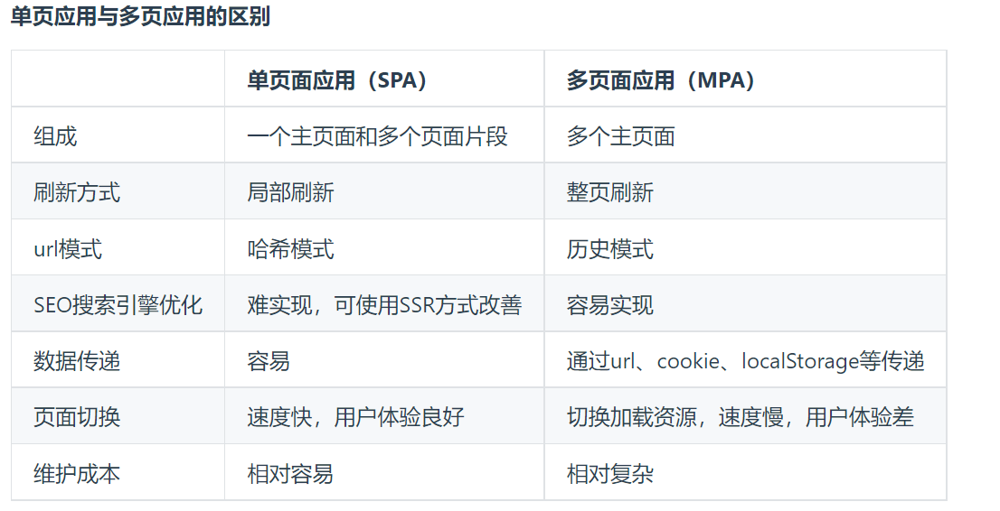

##### 19、单页面和多页面的区别？
[国内 vue 中文社区回答](https://vue3js.cn/interview/vue/spa.html#%E4%B8%89%E3%80%81%E5%AE%9E%E7%8E%B0%E4%B8%80%E4%B8%AAspa)

**单页面：**
单页面也就是 SPA（single-page application），它通过动态重写当前页面来与用户交互，这种方法避免了页面之间切换打断用户体验在单页应用中，所有必要的代码（HTML、JavaScript和CSS）都通过单个页面的加载。
举个例子：
一个杯子，早上装的牛奶，中午装的是开水，晚上装的是茶，我们发现，变的始终是杯子里的内容，而杯子始终是那个杯子。
我们熟知的 `vue` `react` `angular` 都是 SPA 应用。


**多页面：**
多页应用MPA（MultiPage-page application），翻译过来就是多页应用在MPA中，每个页面都是一个主页面，都是独立的当我们在访问另一个页面的时候，都需要重新加载html、css、js文件，公共文件则根据需求按需加载

**区别：**



###### 单页应用优缺点
- 优点：

具有桌面应用的即时性、网站的可移植性和可访问性
用户体验好、快，内容的改变不需要重新加载整个页面
良好的前后端分离，分工更明确

- 缺点：

不利于搜索引擎的抓取
首次渲染速度相对较慢


一个 hash 路由的例子：
```html
<!DOCTYPE html>
<html lang="en">

<head>
  <style>
    div {
      width: 100px;
      height: 100px;
    }

    #app1 {
      background-color: red;
    }

    #app2 {
      background: #000;
    }
  </style>
</head>

<body>
  <div id="app1"></div>
  <div id="app2"></div>
</body>
<script>
  // 定义 Router  
  class Router {
    constructor() {
      this.routes = {}; // 存放路由path及callback  
      this.currentUrl = '';

      // 监听路由change调用相对应的路由回调  
      window.addEventListener('load', this.refresh, false);
      window.addEventListener('hashchange', this.refresh, false);
    }

    route(path, callback) {
      this.routes[path] = callback;
    }

    push(path) {
      this.routes[path] && this.routes[path]()
    }

    refresh() {
      console.log('页面切换了！');
    }
  }

  // 使用 router  
  window.miniRouter = new Router();
  miniRouter.route('/', () => console.log('page1'))
  miniRouter.route('/page2', () => console.log('page2'))


  app1.addEventListener('click', () => {
    miniRouter.push('/') // page1  
  })

  app2.addEventListener('click', () => {
    miniRouter.push('/page2') // page2  
  })
</script>

</html>
```